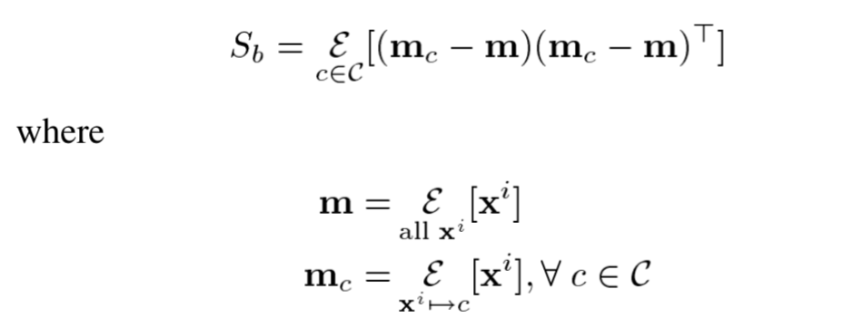
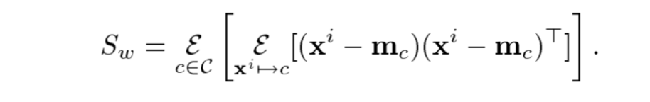
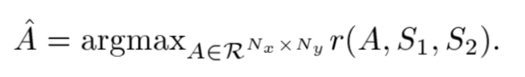

# pyAudioAnalysis and Speaker Diarization

用于speaker Diarization的特征空间质量主要取决于两个因素
1. 是否有足够的信息来区别不同的说话人
2. 特征空间是否包与说话人区别 *无关* 的信息。如果没有预见到的话，会对说话人识别造成很大案影响。（有些特征和说话人识别无关，如果也加进去的话，会对识别结果造成影响）
   

本文的Fisher Linear semi-Discriminat(FLsD)结合了PCA和LDA的优点，
1. 不需要手工标记label
2. 提取的subspace包含说话人和目标音频信号的不同

**应用FLsD的重要优势：** 可以使用比较少的特征，（4个features可以分别5个人）。
使用Fuzzy C-Means用于聚类说话切分，利用K-NN进行聚类，可以达到比较好的效果。

本文主要创新点：
1. 近似最优near-optimal discriminant subspace estraction，可以用于存在must-link约束的半监督学习。关于Relevant component analusis（RCA）有类似研究
    - 利用class threads，以及class to class thread mapping提出预先定义
    - 在宽松class threads 采样约束下，关于FLDA证明约束假设
    - 计算trace-ratio 与ratio-trace
2. FLsD算法用于Speaker diarization，可以检测低维度特征空间，最终的特征可以看成是"fishervoices"
3. 建立了一个系统：FLsD, Fuzzy C-Means, KNN, HMM
   

流程：
- $N_x$维特征聚类到$c$个class，
- 例如有一个序列的$N_x$维特征，每一个投影到一个speaker，
- $R^{N_x}$空间包含两个正交子空间，$N_y$为用于判别的子空间，$N_x$为与分类无关的子空间，（在Section 4中可以证明$N_y << N_x$）
- 本文应用一个半监督方法，提取$N_y$子空间，

FLD matrix是贝叶斯最优：
1. all class-conditional feature vector distributions are Gaussian with the same covariance matrix(Homoskedasticity assumption)
2. the dimension of the resulting subspace is at least as big as the number of classes minus on

## 流程：
1. 对于无重叠的采样$\omega_l$提取特征向量$x_1$， 并将其投影到FLsD子空间$y=\hat{A}_TX_1$
2. a)利用Fuzzy C-Means所有$y$进行聚类，并将每个聚类初始化为一个speaker，b).并对每个$y$生成speaker的label。c).对于每个$y$利用$K = 10% * Len(sample set) $的距离来估计$y$归属的speaker分类
3. 利用1)时序估计的speaker label，2)speaker 转移矩阵，3)speaker的先验概率，4)KNN算法，可以定义出一个HMM模型(状态数=说话人数量)；利用Viterbi算法得到概率最大说话人path
4. 由于HMM smoothing后，更改了一些分类的speaker conditional分布，所以可以迭代进行步骤3
5. 相同的说话人会merge到一起

由于说话人数量未定，step2--4会进行一个说话人数量的循环，利用silhouette width criterion来判断其准确度

## 概念
### FLD = LDA

$y = \hat{A}^T x$

### FLsD
半监督的FLD，属于一定先验知识，本文的先验知识为1s种的class thread内，只有1人说话。

### 半监督学习
"must-link"Constrain 

### HMM
HMM是关于时序的概率模型，描述一个有HMM链随机生成不可观测的状态随机序列，再由各个状态生成一个观测而产生观测随机序列的过程。隐藏的马尔科夫链随机生成的状态序列成为状态序列(state sequence); 每个状态生成一个观测，而由此产生的观测的随机序列称为观测序列(observation sequence)。$\lambda = (A, B, \pi)$，其中$\pi$为初始状态概率向量，$A$为状态转移矩阵，$B$为观测矩阵，$A,B,\pi$为HMM模型三要素。

HMM有3个基本问题
1. 概率计算问题。给定模型$\lambda = (A, B, \omega)$和观测序列$O = (o_1, o_2, ... , o_T)$, 计算在模型$\lambda$下观测序列$O$出现的概率$P(O|\lambda)$。 
2. 学习问题。已知观测序列$O=(o_1, o_2, ... , o_T)，估计模型 $\lambda = (A, B, \pi )$ 参数，是的在该模型下观测序列概率$P(O|\lambda)$最大。即用极大似然估计的方法估计参数。
3. 预测问题，也称解码(decoding)问题。 已知模型$\lambda = (A, B, \pi)$和观测序列$O = (o_1, o_2, ... , o_T)$，求对给定观测序列条件概率$P(I|O)$最大的状态序列$I=(i_1, i_2, ... , i_T)$. 即给定观测序列，求最有可能的对应状态序列
### Viterbi algorithm
HMM模型预测的一种算法

