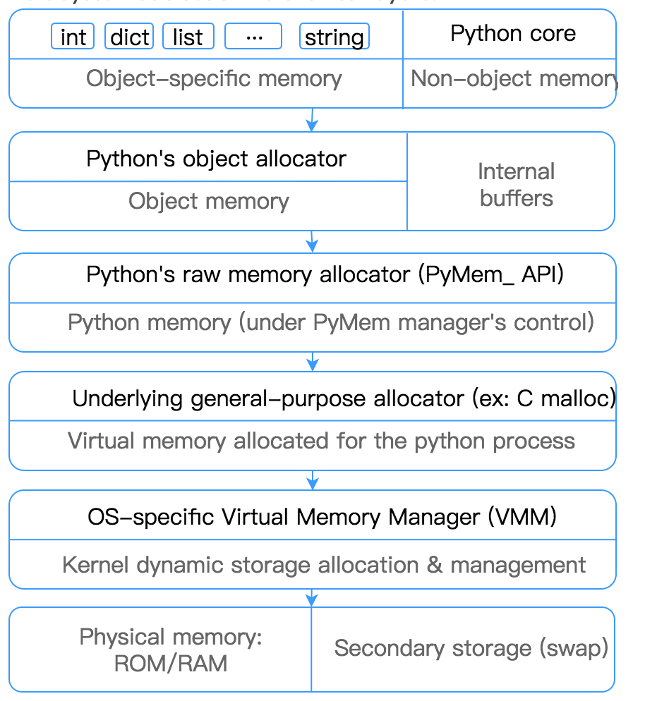
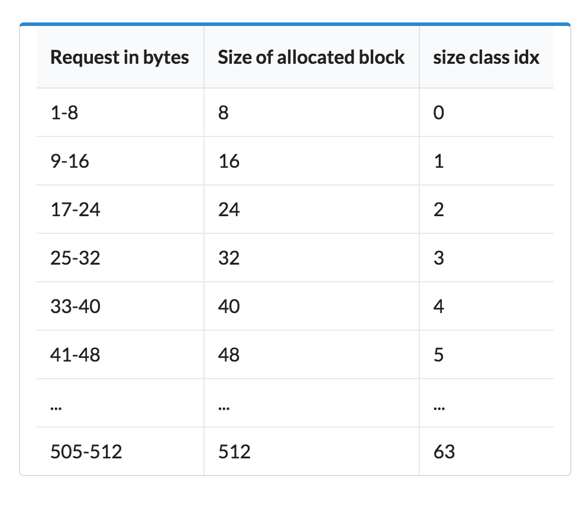
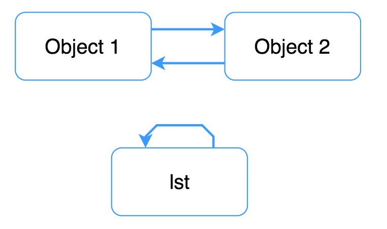

## Python 内存管理

*author:杜远超*

Python 特点：Everything is an object. 有些object可以装其他object，例如list, tuples, dicts, classes。由于Python是冬天语言，所以需要很多的小的内存分配。

Python 内存层级如下



大的内存块是routed到标准的C allocator。针对比较小的object(小于512bytes)Python会将大的内存块进行再次分配。小object分类有三个层级的抽象： `arena`,  `pool` ,`block`

### Block
Block是固定的大小的内存块，Block的大小可以有8 bytes 到512 bytes（每8bytes递增）




### Pool
Pool是大小相同的block的集合。将pool的大小设为固定大小有利于分割，如果一个object被销毁了，memory manager可以将这空间分配为新的有相同大小的object。

```
/* Pool for small blocks. */
struct pool_header {
    union { block *_padding;
            uint count; } ref;          /* number of allocated blocks    */
    block *freeblock;                   /* pool's free list head         */
    struct pool_header *nextpool;       /* next pool of this size class  */
    struct pool_header *prevpool;       /* previous pool       ""        */
    uint arenaindex;                    /* index into arenas of base adr */
    uint szidx;                         /* block size class index        */
    uint nextoffset;                    /* bytes to virgin block         */
    uint maxnextoffset;                 /* largest valid nextoffset      */
};
```
相同大小的block用双链表（`nextpool` 以及`prepool`）结构进行连接成一个pool，`szidx`记录size class index，`ref.count`记录使用的block数目。`arenaindex`存储pool创建的arena的数目。 `freeblock` 记录空blck，如果一个block变空，它将存储下一个空的block的地址。

每个pool有三个状态 `used` `full` `empty`，此外利用`usedpool`来将不同大小的pool进行分类。

注：pool和block都不直接管理内存，使用arenas已经分配的内存进行管理。

### Arena
Arena是heap中256kb的内存分配，可以为64个pool提供内存。


```
struct arena_object {
    uintptr_t address;
    block* pool_address;
    uint nfreepools;
    uint ntotalpools;
    struct pool_header* freepools;
    struct arena_object* nextarena;
    struct arena_object* prevarena;
};
```
arenas也是双链表结构(`nextarena` `prevarena`)，`ntotapools` `nfreepools` 存储当前可用的pools。


### 垃圾回收
Python不需要直接将内存与操作系统交流。常规的CPython的垃圾回收有两个模块：a.引用个计数；b.分代(Generational)内存回收(gc module)。

#### Reference counting
当object没有引用后，会对内存进行释放。每个python的变量都是一个object的引用(指针)。如果reference的技术变为0，CPython自动调用object-specific deallocation函数。如果一个object还包含另一个object的引用，其引用计数也递减。

在函数，类之外定位的全局变量，生命周期一直到Python的进程结束，所以其引用计数从不会掉为0。在blocks中定位的局部变量，生命周期当block退出后，将所有的引用都销毁。

可以使用`sys.getrefcount`查找当前的引用计数。

### Generational 垃圾回收(Garbage collector)
引用计数存在的问题：无法处理引用循环。



例如'lst'指向自己，'object 1'和'object 2'互相引用。此类情况的引用计数永远不会少于1。


```
import gc

# We are using ctypes to access our unreachable objects by memory address.
class PyObject(ctypes.Structure):
    _fields_ = [("refcnt", ctypes.c_long)]


gc.disable()  # Disable generational gc

lst = []
lst.append(lst)

# Store address of the list
lst_address = id(lst)

# Destroy the lst reference
del lst

object_1 = {}
object_2 = {}
object_1['obj2'] = object_2
object_2['obj1'] = object_1

obj_address = id(object_1)

# Destroy references
del object_1, object_2

# Uncomment if you want to manually run garbage collection process 
# gc.collect()

# Check the reference count
print(PyObject.from_address(obj_address).refcnt)
print(PyObject.from_address(lst_address).refcnt)
```

上述代码中`del`语句移除objects的引用，即引用计数减一。当python执行`del`语句后，python 代码就无法获取object，不过其仍在内存中。

循环引用只会出现在容器类objects中，例如list, dictionary, classes, tuples。GC除了tuples不追踪其它不可改变的类型。

与引用计数不同，GC不是实时进行工作，而是周期性进行工作。为降低GC的调用频率，CPython使用不同的层级GC。GC使用3代。每个新的object都在第一代（first generation）。如果一个ojbect再一个GC循环中没有被删除，那么将其移到更高的generation中。lower generation的垃圾回收频率高于older(higher) generation。因为大多数的objects生命周期比较短，所以这种方式能够提高GC的效率以及降低GC暂停时间。

每一代的GC有不同的计数器和阈值来触发运行。Counter存储自从上一次GC后object allocations minus deallocations。

每次进行分配一个新的container ojbect，CPython就会进行一次检测第一代的counter是否超过阈值。如果与两代或是更多代超出阈值范围，GC选择最高的一代。因为最高的一代同样或回收低代。标准的GC阈值是(700,10,10)，可以通过`gc.get_threshold`进行查看。


### 工具：
1. memory_profiler: 第三方库，分析内存使用，输出行号，内存使用情况，内存增长情况
2. objgraph: 第三方库，内存引用关系图。
3. weakref：内置库，用于避免循环引用，与普通引用不同，`weakref.ref`不增加引用计数。
4. gc：内置库，Garbage Controller Interface，包括自动GC的启停；手动进行GC；debug模式设定；修改generation GC阈值